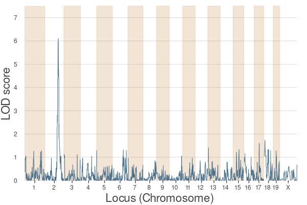
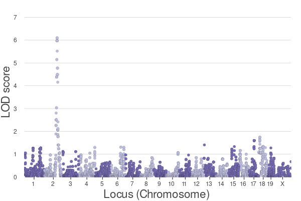

[](https://github.com/senresearch/BigRiverQTL.jl/actions/workflows/ci.yml)
[](https://codecov.io/gh/senresearch/BigRiverQTL.jl)
[](https://www.repostatus.org/#active)


# BigRiverQTL.jl

*A Statistical Toolbox for QTL Analysis*

`BigRiverQTL.jl` is a user-friendly Julia package that supports
efficient and interpretable quantitative trait locus (QTL)
analysis. This comprehensive toolbox encompasses three core components
tailored to streamline the entire QTL analysis workflow:
preprocessing, genomic scanning, and result visualization.

- **Preprocessing:** The preprocessing functions are designed to
  seamlessly import and convert genomic data into an efficient and
  memory-conservative format. This component also offers function
  capabilities for quickly calculating kinship matrices, ensuring data
  readiness for subsequent analysis phases.

- **Genomic Scanning:** `BigRiverQTL.jl` provides advanced genomic
  scanning capabilities through `BulkLMM.jl` for swift single-trait
  scans, which surpass other methods in terms of computational
  speed. For analyses involving multiple traits, the package employs
  `FlxQTL.jl`, a cutting-edge approach that detects complex trait
  interrelations.

- **Result Visualization:** The third component of `BigRiverQTL.jl`
  enriches the analytical experience by offering plotting tools
  designed to illustrate the outcomes of genomic scans. The plotting
  functions are useful for interpreting the results and aid in the
  derivation of meaningful conclusions


## Installation

To install `BigRiverQTL.jl`, you can use Julia's package manager. Here
is the command:

```julia
using Pkg
Pkg.add("BigRiverQTL")
```


## Contribution

Contributions to BigRiverQTL.jl are welcome and appreciated. If you
would like to contribute, please fork the repository, make your
changes, and send us a pull request.  If you have a question or think
you have found a bug, please open an issue.


# Example QTL
___

This example is also available as a
[notebook](example/example_qtl.ipynb) in the 'example' directory.

## Data

In this example, we will use a dataset available from the `R/qtl2`
package. Specifically, we will use the BXD dataset, which is obtained
from the [GeneNetwork](https://genenetwork.org/) website.

You can download the BXD genotype data from the following link:
[Download BXD Genotype
Data](https://raw.githubusercontent.com/rqtl/qtl2data/master/BXD/bxd.zip)


### Example - BXD 


```julia
# Libraries
using BigRiverQTL
using Plots
```

#### Data

We assume that the data is stored in `..\data\BXD` directory.


```julia
########
# Data #
########
data_dir = joinpath(@__DIR__, "../data/BXD/");
file = joinpath(data_dir, "bxd.json");
```

Load bxd data using the function `get_geneticstudydata()`: 


```julia
# Load bxd data
data = get_geneticstudydata(file);
```


```julia
# Data types
# makers info 
gInfo = data.gmap;
# pehnotype info 
pInfo = data.phenocov;
# phenotype values 
pheno = data.pheno.val;

# We can get the genotype matrix using the following command:
geno = reduce(hcat, data.geno.val);
# For computing reasons, we need to convert the geno matrix in Float64
geno_processed = convert(Array{Float64}, geno);
```

#### Preprocessing


```julia
#################
# Preprocessing #
#################
traitID = 1112;
pheno_y = pheno[:, traitID];
pheno_y2=ones(length(pheno_y));
idx_nothing = findall(x->x!=nothing,pheno_y)
pheno_y2[idx_nothing]=pheno_y[idx_nothing];
```

#### Kinship


```julia
###########
# Kinship #
###########
kinship = kinship_gs(geno_processed,.99);
```

#### Scan


```julia
########
# Scan #
########

single_results_perms = scan(
	pheno_y2,
	geno_processed,
	kinship;
	permutation_test = true,
	nperms = 1000,
);
```

#### Preprocessing

#### Plots


```julia
#########
# Plots #
#########

# QTL plots
plot_QTL(single_results_perms, gInfo, mbColname = "Pos")

```


```julia
# Manhattan plots
plot_manhattan(single_results_perms, gInfo, mbColname = "Pos")
```

