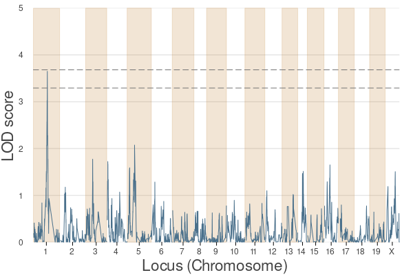
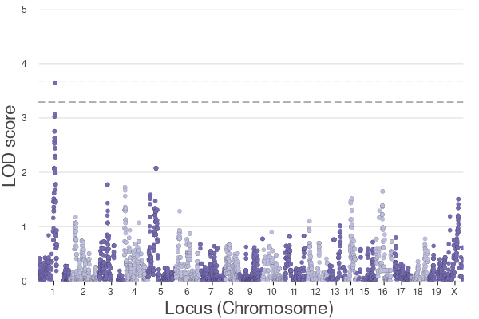

[](https://github.com/senresearch/BigRiverQTL.jl/actions/workflows/ci.yml)
[](https://codecov.io/gh/senresearch/BigRiverQTL.jl)
[](https://www.repostatus.org/#active)


# BigRiverQTL.jl

*A Statistical Toolbox for QTL Analysis*

`BigRiverQTL.jl` is a package that makes it easier to perform
quantitative trait locus (QTL) analysis in Julia.  It consists of
three components streamline the QTL analysis workflow:
preprocessing, genome scans, and visualization.

- **Preprocessing:** The preprocessing functions are designed to
  seamlessly import and convert genomic data into an efficient and
  memory-conservative format. This component also offers function
  capabilities for quickly calculating kinship matrices, ensuring data
  readiness for subsequent analysis phases.

- **Genome Scans:** We provide the capabilities to perform a large
  number of univariate genome scans using
  [`BulkLMM.jl`](https://github.com/senresearch/BulkLMM.jl). For
  analyses involving multiple traits, we provide an interface to
  [`FlxQTL.jl`](https://github.com/senresearch/FlxQTL.jl) to analyze
  longitudinal traits and complex trait correlations.

- **Visualization:** The third component of the package offers
  plotting tools designed to visualize genome scans including eQTL
  scans using the
  [`BigRiverQTLPlots.jl`](https://github.com/senresearch/BigRiverQTLPlots.jl)
  package.

## Installation

To install `BigRiverQTL.jl`, you can use Julia's package manager. Here
is the command:

```julia
using Pkg
Pkg.add("BigRiverQTL")
```


## Contribution

Contributions to BigRiverQTL.jl are welcome and appreciated. If you
would like to contribute, please fork the repository, make your
changes, and send us a pull request.  If you have a question or think
you have found a bug, please open an issue.


# Example QTL
___

This example is also available as a
[notebook](example/example_qtl.ipynb) in the 'example' directory.

## Data

In this example, we will use a dataset available from the `R/qtl2`
package. Specifically, we will use the BXD dataset, which is obtained
from the [GeneNetwork](https://genenetwork.org/) website.

You can download the BXD genotype data from the following link:
[Download BXD Genotype
Data](https://raw.githubusercontent.com/rqtl/qtl2data/master/BXD/bxd.zip)


### Example - BXD 


```julia
# Libraries
using BigRiverQTL
using Plots
```

#### Data

We assume that the data is stored in `..\data\BXD` directory.


```julia
########
# Data #
########
data_dir = joinpath(@__DIR__, "../data/BXD/");
file = joinpath(data_dir, "bxd.json");
```

Load bxd data using the function `get_geneticstudydata()`: 


```julia
# Load bxd data
data = get_geneticstudydata(file);
```

```julia
# The current version of `BigRiverQTL` does not have imputation functions.
# Remove the  missing data
data = get_data_completecases(data);
```

```julia
# Data types
# gmap contains 
# makers info 
gInfo = data.gmap;

# phenotype info 
pInfo = data.phenocov;
# phenotype values 
pheno = data.pheno.val;

# We can get the genotype matrix using the following command.
# For computing reasons, we need to convert the geno matrix in Float64.
# One way to do it is to multiply by 1.0
geno = reduce(hcat, data.geno.val).*1.0;
```

#### Preprocessing


```julia
#################
# Preprocessing #
#################
traitID = 1112;
pheno_y = pheno[:, traitID];
pheno_y2 = ones(length(pheno_y));
idx_not_missing = findall(!ismissing, pheno_y)
pheno_y2[idx_not_missing] = pheno_y[idx_not_missing];
```

#### Kinship


```julia
###########
# Kinship #
###########
kinship = kinship_gs(geno,.99);
```

#### Scan


```julia
########
# Scan #
########

single_results_perms = scan(
	pheno_y2,
	geno,
	kinship;
	permutation_test = true,
	nperms = 1000,
);
```

### Plots


```julia
#########
# Plots #
#########

# QTL plots
plot_QTL(single_results_perms, gInfo, mbColname = "Pos")

```


```julia
# Manhattan plots
plot_manhattan(single_results_perms, gInfo, mbColname = "Pos")
```

