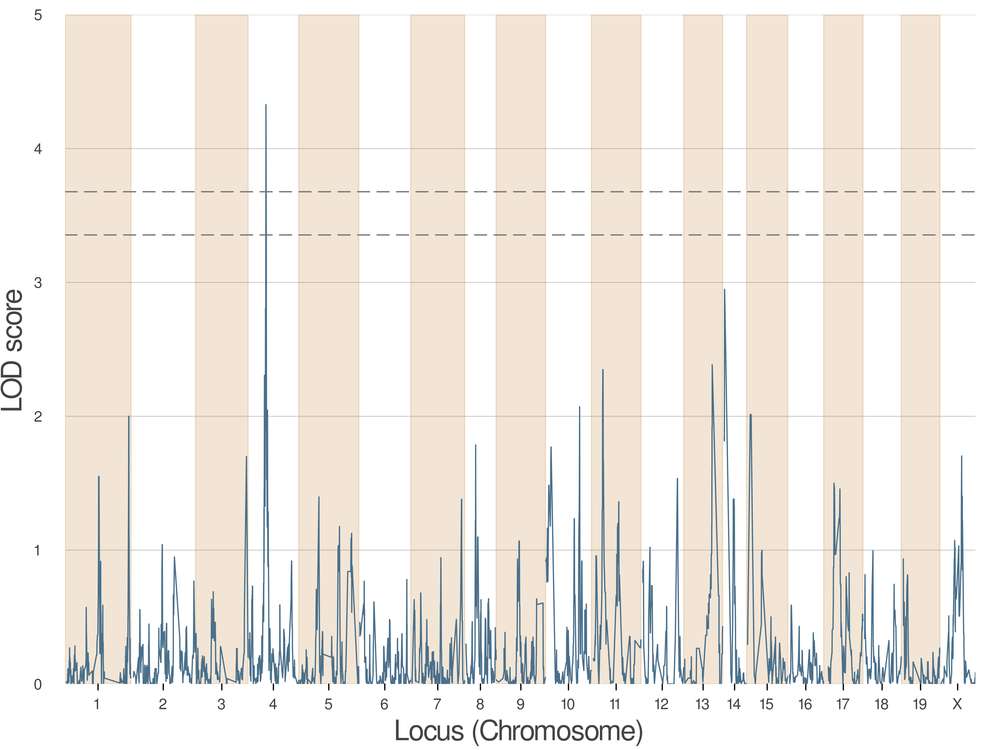
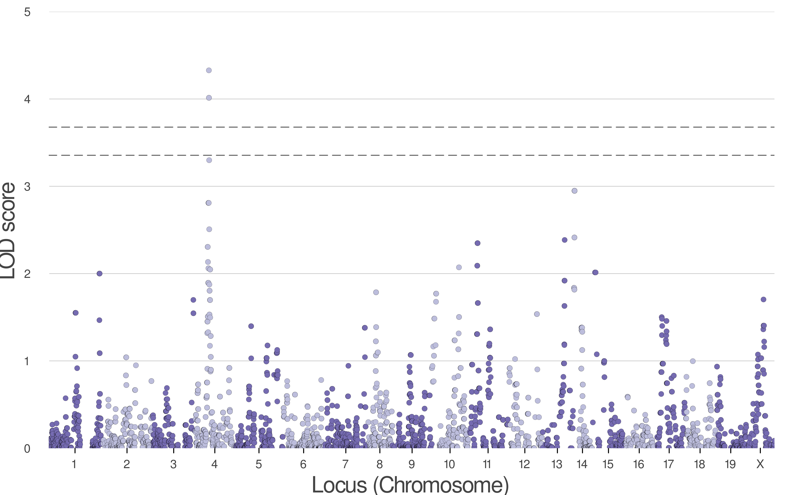

---
jupyter:
  jupytext:
    formats: ipynb,Rmd
    text_representation:
      extension: .Rmd
      format_name: rmarkdown
      format_version: '1.2'
      jupytext_version: 1.17.3
  kernelspec:
    display_name: R
    language: R
    name: ir
---

# How to use BulkLMM scan from BigRiverQTL in R with JuliaConnectoR?


`JuliaConnectoR` is a package that enables the integration of Julia language into R programming. 
With `JuliaConnectoR`, users can execute Julia commands and functions within R, utilizing Julia's 
high-performance computing capabilities while still working within the familiar R environment. 
The package provides seamless communication between the two languages, allowing for data to be 
passed between R and Julia with ease. `JuliaConnectoR` also provides for the installation of Julia 
packages from within R, making it a convenient tool for those looking to leverage the power 
of Julia while still utilizing R as their primary programming language.   

*Note: [Link to the documentation of the package `JuliaConnectoR`](https://github.com/stefan-m-lenz/JuliaConnectoR?tab=readme-ov-file).*


## Environment and libraries

```{r}
if (!require(JuliaConnectoR)) {
  install.packages("JuliaConnectoR")
}
if (!require(png)) {
  install.packages("magick")
}
```

```{r}
# load necessary library
library(JuliaConnectoR)
library(magick)

```

Create a Julia project environment:

```{r}
juliaEval('using Pkg')
juliaEval('Pkg.activate(".")')
```

Install `BigRiverQTL` and `Plots` if it is not already installed in Julia:

```{r}
# Change need2install into TRUE if you need to install the Julia libraries
need2install <- FALSE
if(need2install){
    juliaEval('Pkg.add("BigRiverQTL")')
}
```

```{r}
# Change need2install into TRUE if you need to install the Julia libraries
need2install <- FALSE
if(need2install){
    juliaEval('Pkg.add("Plots")')
}
```

Load the library `BigRiverQTL`and `Plots`:

```{r}
 juliaEval('using BigRiverQTL, Plots')
```

Load the `BigRiverQTL` package so that its functions can be accessed from within R.

```{r}
# load BigRiverQTL features available in R
BigRiverQTL <- juliaImport("BigRiverQTL")
```

## Example - BXD 


### Data

```{r}
########
# Data #
########
# get path of data example from the package
pathBigRiverQTL <- juliaEval('pathof(BigRiverQTL) |> dirname |>dirname')
data_path <- file.path(pathBigRiverQTL, "test", "data", "BXD", "bxd.json")  

# check if path is correct
data_path |> file.exists()
```

Load bxd data using the function `get_geneticstudydata()`: 

```{r}
# Load bxd data
data <- BigRiverQTL$get_geneticstudydata(data_path)
```


The current version of `BigRiverQTL` does not have imputation functions.

```{r}
# The current version of `BigRiverQTL` does not have imputation functions.
# Remove the  missing data
data <- BigRiverQTL$get_data_completecases(data);
```

Get the markers info:

```{r}
# gmap contains makers info 
gInfo <- data$gmap;
```

```{r}
juliaGet(gInfo) |> names()
```

Get the phenotype info:

```{r}
# phenotype info 
pInfo <- data$phenocov;
```

```{r}
juliaGet(pInfo) |> names()
```

```{r}
# phenotype values 
pheno <- data$pheno$val;
```

Get the genotype matrix:

```{r}
# We can get the genotype matrix using the following command.
# For computing reasons, we need to convert the geno matrix in Float64.
# One way to do it is to multiply by 1.0
geno <- juliaLet("reduce(hcat, genoval).*1.0", genoval = data$geno$val)
```

### Preprocessing

```{r}
#################
# Preprocessing #
#################
traitID <- 868;
pheno_y <- pheno[, traitID];
idx_not_missing <- which(!is.na(pheno_y));
```

### Kinship

```{r}
###########
# Kinship #
###########
kinship <- BigRiverQTL$kinship_gs(geno[idx_not_missing,],0.99);
```

### Scan

```{r}
########
# Scan #
########

single_results_perms <- BigRiverQTL$scan(
	pheno_y[idx_not_missing],
	geno[idx_not_missing,],
	kinship,
	permutation_test = TRUE,
	nperms = 1000L
);
```

### Plots

```{r}
#########
# Plots #
#########

# QTL plots
p <- BigRiverQTL$plot_QTL(single_results_perms, gInfo, mbColname = "Pos", size = list(800,600), dpi = 600L)
juliaLet('savefig(p, "qtl_plot.png");', p = p)
```

```{r}
# image_read("qtl_plot.png") |> image_scale("600") |> print()
```




We can also display directly the figure from Julia:

```{r}
juliaLet('display(p)', p = p)
```

```{r}
# Manhattan plots
p <- BigRiverQTL$plot_manhattan(single_results_perms, gInfo, mbColname = "Pos", size = list(800,600), dpi = 660L)
juliaLet('savefig(p, "manhattan_plot.png");', p = p);
```

```{r}
juliaLet('display(p)', p = p)
```


